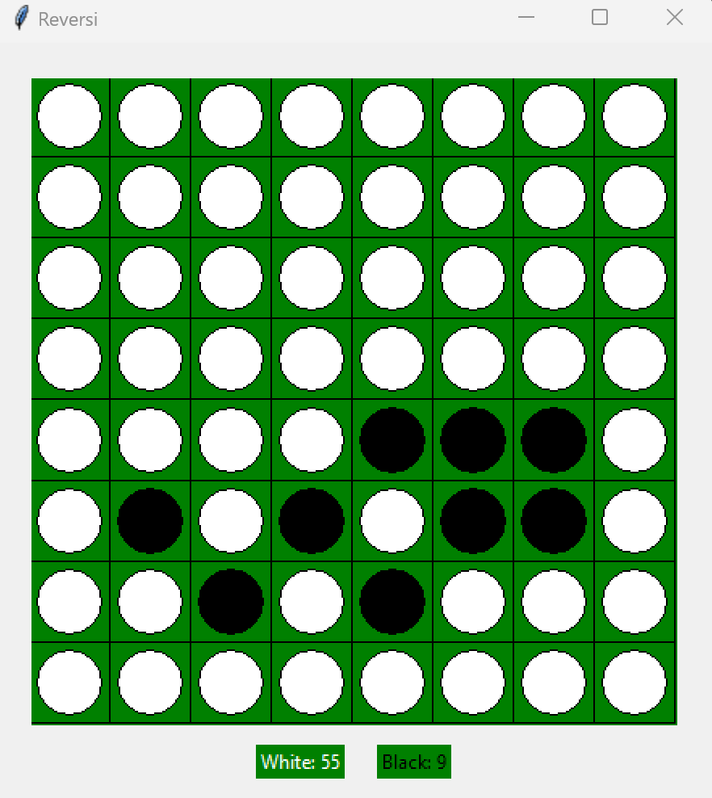

# AI BOARD GAME REVERSI

{:width="25px" height="25px"}

## Background about Reversi

**Here are the rules of Reversi:**

- Starting Position: The game starts with four discs placed in the center of the board in a pattern of two black discs and two white discs, arranged diagonally with same-colored discs facing each other.

- Turns: Players take turns placing one disc of their color on an empty square on the board. Black always plays first.

- Legal Moves: A move is legal if and only if it results in at least one of the opponent's discs being flipped (changed to the current player's color) along a straight line (horizontally, vertically, or diagonally) between the newly placed disc and another disc of the current player's color. This means that at least one of the opponent's discs must be sandwiched between the newly placed disc and another disc of the current player's color.

- Flipping: When a player makes a legal move and flips one or more of the opponent's discs, all of the flipped discs are turned to the current player's color.

- End of the Game: The game ends when either:
i) Both players have no legal moves left.
ii) The board is full.

- Winning: The player with the most discs of their color on the board at the end of the game wins. It's possible for the game to end in a tie if both players have the same number of discs.

## Heuristic Evaluator
### Heuristic Strategy 1: Coin Parity
- **Description**: Calculates the difference between the number of disks of the player's color and the opponent's color.
- **Formula**: `max_score - min_score`, where `max_score` is the total number of player's disks and `min_score` is the total number of opponent's disks.
- **Advantage**: Encourages the player to aim for having more disks than the opponent on the board.
- **Disadvantage**: Ignores other important factors like mobility and positional advantage.

### Heuristic Strategy 2: Mobility
- **Description**: Computes the difference between the number of valid moves available to the player and the opponent.
- **Formula**: `max_mobility - min_mobility`, where `max_mobility` is the number of valid moves for the player and `min_mobility` is the number of valid moves for the opponent.
- **Advantage**: Promotes actions that increase the player's mobility, allowing for more strategic options.
- **Disadvantage**: Doesn't consider the quality of the moves or positional advantage.

### Heuristic Strategy 3: Mobility and Corners
- **Description**: Combines the evaluation of mobility with the control of corner positions.
- **Formula**: `(max_mobility + max_corners) - (min_mobility + min_corners)`, where `max_corners` is the number of corners controlled by the player and `min_corners` is the number of corners controlled by the opponent.
- **Advantage**: Rewards the player for controlling corner positions, which are strategically valuable in Reversi.
- **Disadvantage**: Still overlooks other aspects like edge control and disk stability.

### Heuristic Strategy 4: Mobility and Stability
- **Description**: Integrates mobility with disk stability, where stability refers to the number of stable disks on the board.
- **Formula**: `(max_mobility + max_stability) - (min_mobility + min_stability)`, where `max_stability` is the number of stable disks for the player and `min_stability` is the number of stable disks for the opponent.
- **Advantage**: Encourages the player to create stable positions, which are less likely to be flipped by the opponent.
- **Disadvantage**: May not prioritize immediate board control or strategic positions.

### Heuristic Strategy 5: Mobility, Corners, and Edges
- **Description**: Extends the evaluation to include edge control along with mobility and corners.
- **Formula**: `(max_mobility + max_corners + max_edges) - (min_mobility + min_corners + min_edges)`, where `max_edges` is the number of edges controlled by the player and `min_edges` is the number of edges controlled by the opponent.
- **Advantage**: Recognizes the importance of controlling edges, which can limit opponent's mobility and provide positional advantage.
- **Disadvantage**: Complexity increases with more factors considered, potentially leading to longer evaluation times.

### Heuristic Strategy 6: Mobility, Corners, Edges, and Stability
- **Description**: Integrates all previously mentioned factors: mobility, corners, edges, and disk stability.
- **Formula**: `(max_mobility + max_corners + max_edges + max_stability) - (min_mobility + min_corners + min_edges + min_stability)`.
- **Advantage**: Provides a comprehensive evaluation considering various strategic elements of the game.
- **Disadvantage**: Increased computational complexity due to the combination of multiple factors, potentially leading to slower decision-making.

## Min Max Algorithm

## Alpha Beta Prunning

## ReversiAI